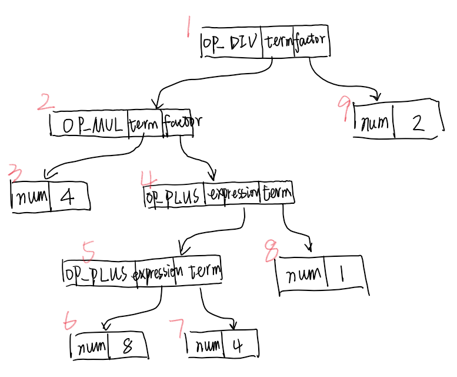

# lab2 实验报告
学号：PB19151776 姓名：廖佳怡

## 问题1: cpp 与 .ll 的对应
请说明你的 cpp 代码片段和 .ll 的每个 BasicBlock 的对应关系。
* assign
  ##### assign_generator.cpp:
  ```
  //main函数
  auto mainFun = Function::create(FunctionType::get(Int32Type,{}),
                                                  "main",module);
  auto bb = BasicBlock::create(module,"entry",mainFun); // BasicBlock的名字在生成无所谓,但是可以方便阅读
  builder->set_insert_point(bb);
  auto retAlloca = builder->create_alloca(Int32Type); // 在内存中分配返回值
  builder->create_store(CONST_INT(0), retAlloca); // 返回值默认为0
  DEBUG_OUTPUT
  //int a[10];
  ArrayType *a = ArrayType::get(Int32Type, 10); // 定义a[10]的类型
  auto a_array_Alloca = builder->create_alloca(a); // 在内存中分配a[10]
  DEBUG_OUTPUT
  //a[0]=10;
  auto a0GEP = builder->create_gep(a_array_Alloca,{CONST_INT(0),CONST_INT(0)}); / 得到a[0]在内存中的指针
  builder->create_store(CONST_INT(10),a0GEP); // 在内存中赋值为10
  DEBUG_OUTPUT
  //a[1]=a[0]*2;
  auto a1GEP = builder->create_gep(a_array_Alloca,{CONST_INT(0),CONST_INT(1)}); / 得到a[1]在内存中的指针
  auto a0Load = builder->create_load(a0GEP); // load a[0] 
  builder->create_store(CONST_INT(10),a1GEP); // 在内存中赋值为10
  auto a0_mul_2 = builder->create_imul( a0Load, CONST_INT(2)); // 计算a[0]*2
  builder->create_store(a0_mul_2,a1GEP); // 将a[0]*2的结果存入a[1]
  DEBUG_OUTPUT
  //return a[1]
  
  auto a1Load = builder->create_load(a1GEP); // load a[1]
  builder->create_store(a1Load,retAlloca); // store a[1] to retAlloca
  auto retLoad = builder->create_load(retAlloca); // load retLoad
  builder->create_ret(retLoad); //return retLoad
  ```
  ##### stu_assign_generator.ll
  ```
  define i32 @main() {
  label_entry:
    %op0 = alloca i32
    store i32 0, i32* %op0
    %op1 = alloca [10 x i32]
    %op2 = getelementptr [10 x i32], [10 x i32]* %op1, i32 0, i32 0
    store i32 10, i32* %op2
    %op3 = getelementptr [10 x i32], [10 x i32]* %op1, i32 0, i32 1
    %op4 = load i32, i32* %op2
    store i32 10, i32* %op3
    %op5 = mul i32 %op4, 2
    store i32 %op5, i32* %op3
    %op6 = load i32, i32* %op3
    store i32 %op6, i32* %op0
    %op7 = load i32, i32* %op0
    ret i32 %op7
  }
  ```
  共有1个基本块：
  * `auto bb = BasicBlock::create(module,"entry",mainFun);`对应于`label_entry`
* fun
  ##### fun_generator.cpp
  ```
  //callee函数
  // 函数参数类型的vector
  std::vector<Type *> Ints(1, Int32Type);
  auto calleeFun = Function::create(FunctionType::get(Int32TypeInts),
                                                  "callee",module);
  auto bb = BasicBlock::create(module,"callee",calleeFun); //BasicBlock的名字在生成中无所谓,但是可以方便阅读
  builder->set_insert_point(bb);
  auto retAlloca = builder->create_alloca(Int32Type); // 在内存中配返回值
  builder->create_store(CONST_INT(0), retAlloca); // 返回值默认为0
  DEBUG_OUTPUT
  //read params: (int a)
  std::vector<Value *> args;  // 获取callee函数的形参,通过Function的iterator
  for (auto arg = calleeFun->arg_begin(); arg != calleeFun->arg_en(); arg++) {
      args.push_back(*arg);   // * 号运算符是从迭代器中取出迭代器当指向的元素
  }
  //return 2*a 
  auto aAlloca = builder->create_alloca(Int32Type); // 为a分配内存
  builder->create_store(args[0],aAlloca); // 将参数a的值读取aAlloca中
  auto aLoad = builder->create_load(aAlloca); // load a
  auto mul = builder->create_imul(aLoad, CONST_INT(2)); // 计算a*2
  builder->create_store(mul,retAlloca); //将乘积存在a2Alloca中
  
  auto retLoad = builder->create_load(retAlloca); // load retLoad
  builder->create_ret(retLoad);
  DEBUG_OUTPUT
  
  //main函数
  auto mainFun = Function::create(FunctionType::get(Int32Type,{}),
                                                  "main",module);
  bb = BasicBlock::create(module,"entry",mainFun); // BasicBlock名字在生成中无所谓,但是可以方便阅读
  builder->set_insert_point(bb);
  retAlloca = builder->create_alloca(Int32Type); // 在内存中分配返值
  builder->create_store(CONST_INT(0), retAlloca); // 返回值默认为0
  DEBUG_OUTPUT
  //return callee(110)
  auto call = builder->create_call(calleeFun,{CONST_INT(110)});
  builder->create_ret(call);
  ```
  ##### stu_fun_generator.ll
  ```
  define i32 @callee(i32 %arg0) {
  label_callee:
    %op1 = alloca i32
    store i32 0, i32* %op1
    %op2 = alloca i32
    store i32 %arg0, i32* %op2
    %op3 = load i32, i32* %op2
    %op4 = mul i32 %op3, 2
    store i32 %op4, i32* %op1
    %op5 = load i32, i32* %op1
    ret i32 %op5
  }
  define i32 @main() {
  label_entry:
    %op0 = alloca i32
    store i32 0, i32* %op0
    %op1 = call i32 @callee(i32 110)
    ret i32 %op1
  }
  ```
  共有2个基本块：
  * `auto bb = BasicBlock::create(module,"entry",calleeFun);`对应于`label_callee`
  * `bb = BasicBlock::create(module,"entry",mainFun);`对应于`label_entry`
* if
  ##### if_generator.cpp
  ```
  //main函数
  auto mainFun = Function::create(FunctionType::ge(Int32Type,{}),
                                                  "mainmodul);
  auto bb = BasicBlock::create(module,"entry",mainFun);// BasicBlock的名字在生成中无所谓,但是可以方便阅读
  builder->set_insert_point(bb);
  auto retAlloca = builder->create_alloca(Int32Type); / 在内存中分配返回值
  builder->create_store(CONST_INT(0), retAlloca); // 回值默认为0
  auto retLoad = builder->create_load(retAlloca); /load retLoad
  DEBUG_OUTPUT
  //float a=5.555
  auto aAlloca = builder->create_alloc(Type::get_float_type(module)); // 在内存中为a分配空间
  builder->create_store(CONST_FP(5.555), aAlloca); //store 5.555 in a
  //if(a>1)
  auto trueBB = BasicBlock::create(module,"in_if"mainFun); // in_if 分支
  auto falseBB = BasicBlock::create(module,"after_if"mainFun); // after_if 分支
  auto aLoad = builder->create_load(aAlloca); //loadaLoad
  auto fcmp = builder->create_fcmp_gt(aLoad, CONST_FP(1); // compare a>1
  auto br = builder->create_cond_br(fcmp, trueBB,falseBB);
  //return 233
  builder->set_insert_point(trueBB); // trueBB 分支
  builder->create_store(CONST_INT(233),retAlloca); //store 233 in retAlloca
  retLoad = builder->create_load(retAlloca); // loadretLoad
  builder->create_ret(retLoad); //return retLoad
  DEBUG_OUTPUT
  //return 0
  builder->set_insert_point(falseBB); // falseBB分支
  retLoad = builder->create_load(retAlloca); // load [1]
  builder->create_ret(retLoad); // return retLoad
  ```
  ##### stu_if_generator.ll
  ```
  define i32 @main() {
  label_entry:
    %op0 = alloca i32
    store i32 0, i32* %op0
    %op1 = load i32, i32* %op0
    %op2 = alloca float
    store float 0x40163851e0000000, float* %op2
    %op3 = load float, float* %op2
    %op4 = fcmp ugt float %op3,0x3ff0000000000000
    br i1 %op4, label %label_in_if, label %label_after_if
  label_in_if:                                                  ; preds = %label_entry
    store i32 233, i32* %op0
    %op5 = load i32, i32* %op0
    ret i32 %op5
  label_after_if:                                                  ; preds = %label_entry
    %op6 = load i32, i32* %op0
    ret i32 %op6
  }
  ```
  共有3个基本块：
  * `auto bb = BasicBlock::create(module,"entry",mainFun);`对应于`label_entry`
  * `auto trueBB = BasicBlock::create(module,"in_if"mainFun);`对应于`label_in_if`
  * `auto falseBB = BasicBlock::create(module,"after_if"mainFun);`对应于`label_after_if`
* while
  ##### while_generator.cpp
  ```
  //main函数
  auto mainFun = Function::create(FunctionType::get(Int32Type,{}),
                                                  "main",module);
  auto bb = BasicBlock::create(module,"entry",mainFun); //BasicBlock的名字在生成中无所谓,但是可以方便阅读
  builder->set_insert_point(bb);
  auto retAlloca = builder->create_alloca(Int32Type); // 在内存中配返回值
  builder->create_store(CONST_INT(0), retAlloca); // 返回值默认为0
  auto retLoad = builder->create_load(retAlloca); //load retLoad
  DEBUG_OUTPUT
  //int a
  auto aAlloca = builder->create_alloca(Int32Type); // 在内存中分配a
  //int i
  auto iAlloca = builder->create_alloca(Int32Type); // 在内存中分配i
  //a=10
  builder->create_store(CONST_INT(10),aAlloca); // store 10 in a
  //i=0
  builder->create_store(CONST_INT(0),iAlloca); //store 0 in i
  //while(i<10)
  auto trueBB = BasicBlock::create(module,"in_while",mainFun); //in_while 分支
  auto falseBB = BasicBlock::create(module,"after_while",mainFun);// after_while 分支
  auto iLoad = builder->create_load(iAlloca); //load iLoad
  auto icmp = builder->create_icmp_lt(iLoad, CONST_INT(10)); //compare i<10
  auto br = builder->create_cond_br(icmp, trueBB, falseBB); //jump
  //i=i+1
  builder->set_insert_point(trueBB); // trueBB 分支
  iLoad = builder->create_load(iAlloca); //load iLoad
  auto add = builder->create_iadd(iLoad,CONST_INT(1)); // i+1
  builder->create_store(add,iAlloca); //i=i+1
  //a=a+i
  auto aLoad = builder->create_load(aAlloca); //load aLoad
  iLoad = builder->create_load(iAlloca); //load iLoad
  add = builder->create_iadd(aLoad,iLoad); // a+i
  builder->create_store(add, aAlloca); //a=a+i
  //while(i<10)
  iLoad = builder->create_load(iAlloca); //load iLoad
  icmp = builder->create_icmp_lt(iLoad, CONST_INT(10)); // comparei<10
  br = builder->create_cond_br(icmp, trueBB, falseBB); //jump
  DEBUG_OUTPUT
  //return 0
  builder->set_insert_point(falseBB); // falseBB分支
  aLoad = builder->create_load(aAlloca); //load aLoad
  builder->create_store(aLoad, retAlloca); //store aLoad inretAlloca
  retLoad = builder->create_load(retAlloca); // load retAlloca
  builder->create_ret(retLoad); // return retLoad
  ```
  ##### stu_while_generator.ll
  ```
  define i32 @main() {
  label_entry:
    %op0 = alloca i32
    store i32 0, i32* %op0
    %op1 = load i32, i32* %op0
    %op2 = alloca i32
    %op3 = alloca i32
    store i32 10, i32* %op2
    store i32 0, i32* %op3
    %op4 = load i32, i32* %op3
    %op5 = icmp slt i32 %op4, 10
    br i1 %op5, label %label_in_while, label %label_after_while
  label_in_while:                                                ;  preds = %label_entry, %label_in_while
    %op6 = load i32, i32* %op3
    %op7 = add i32 %op6, 1
    store i32 %op7, i32* %op3
    %op8 = load i32, i32* %op2
    %op9 = load i32, i32* %op3
    %op10 = add i32 %op8, %op9
    store i32 %op10, i32* %op2
    %op11 = load i32, i32* %op3
    %op12 = icmp slt i32 %op11, 10
    br i1 %op12, label %label_in_while, label %label_after_while
  label_after_while:                                                ;   preds = %label_entry, %label_in_while
    %op13 = load i32, i32* %op2
    store i32 %op13, i32* %op0
    %op14 = load i32, i32* %op0
    ret i32 %op14
  }
  ```
  共有3个基本块：
  * `auto bb = BasicBlock::create(module,"entry",mainFun);`对应于`label_entry`
  * `auto trueBB = BasicBlock::create(module,"in_while",mainFun);`对应于`label_in_while`
  * `auto falseBB = BasicBlock::create(module,"after_while",mainFun);`对应于`label_after_while`

## 问题2: Visitor Pattern
分析 `calc` 程序在输入为 `4 * (8 + 4 - 1) / 2` 时的行为：
1. 请画出该表达式对应的抽象语法树（使用 `calc_ast.hpp` 中的 `CalcAST*` 类型和在该类型中存储的值来表示），并给节点使用数字编号。
2. 请指出示例代码在用访问者模式遍历该语法树时的遍历顺序。

序列请按如下格式指明（序号为问题 2.1 中的编号）：  
3->2->5->1

1. 
2. 1->2->3->4->5->6->7->8->9


## 问题3: getelementptr
请给出 `IR.md` 中提到的两种 getelementptr 用法的区别,并稍加解释:
  - `%2 = getelementptr [10 x i32], [10 x i32]* %1, i32 0, i32 %0`
  - `%2 = getelementptr i32, i32* %1, i32 %0`

* 第一行返回值是`[10 x i32]`,从`%1`指向的[10 x i32]偏移`%0`：
  其中第一组`<type> <idx>`即`i32 0`指`[10 x i32]`(指针`[10 x i32]*`地址的内容)。
  其中第二组`<type> <idx>`即`i32 %0`指相对于`[10 x i32]`的偏移类型为`i32`,偏移值为`%0`
* 第二行返回值是`i32`:
  偏移起始为`i32 *`类型的`%1`,`<type> <idx>`即`i32 %0` 指偏移类型为`i32`,偏移值为`%0`
  

## 实验难点
描述在实验中遇到的问题、分析和解决方案。

* 问题1
  问题：Constant Float invalid for Type in if_hand.ll
  分析：查阅资料关于LLVM IR中浮点常数的表示
  解决方案：借助工具 https://baseconvert.com/ieee-754-floating-point 得到5.555的六十四位浮点数的十六进制表示，也参考了clang的输出

* 问题2
  问题：LightIR + cpp 编写程序时对数组结构和引用值的理解
  分析：仔细阅读 https://llvm.org/docs/GetElementPtr.html 文档中对`getelementptr` 指令的介绍，也参考了助教给的样例`gcd_array_generator.cpp`
  解决方案：在`assign.c`中`auto a1GEP = builder->create_gep(a_array_Alloca,{CONST_INT(0),CONST_INT(1)}); // 得到a[1]在内存中的指针`

* 问题3
  问题：`make install`的时候得到了`Permission denied`的error
  分析：可能是权限问题，需要查阅`make install`指令具体完成了什么动作，及和`make`指令对比的资料
  解决方案：`sudo make install`，并在github上面share了我的解决方案

## 实验反馈
吐槽?建议?
这次实验中，助教提供的文档由浅入深，也提供了具体的案例，很便于我们初学者入门理解。
